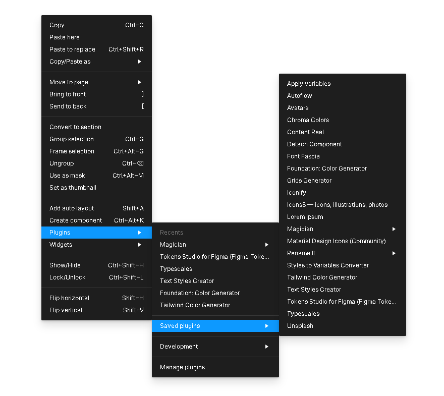

# Ch01. 피그마 플러그인 설치 목록

 
 

- 피그마 강의 순서 안내

[https://www.figma.com/board/cEunzzCWqacFCxPkcxCfLh/Figma-Learning?node-id=0-1&t=eM4OvDtptJ4kuuDe-1](https://www.figma.com/board/cEunzzCWqacFCxPkcxCfLh/Figma-Learning?node-id=0-1&t=eM4OvDtptJ4kuuDe-1)  

 

## 1. 플러그인 목록

 

1. Apply variables
2. Autoflow
3. Avatars
4. Chroma Colors
5. Contrent Real
6. Detach Component
7. Font Changer
8. Font Fascia
9. Color Generator
10. Grids Generation
11. Iconify
12. Icon8
13. Lorem Ipsum
14. Magiican
15. Material Design Icons
16. Recents
17. Rename it
18. Foundation Color Generator
19. Styles to Variables Converter
20. Tailwind Color Generation
21. Text Styles Creator
22. Table Creator
23. Tokens Studio for Pigma(Figma Tokens)
24. Typescales
25. Unsplash
  
 
 

## 2. 플러그인 메뉴 찾기

   

- 마우스 오른쪽 클기하면 나타나는 팝업메뉴 중 \[ Plugins \] 메뉴를 선택하면 아래처럼 설치된 플러그인들을 살펴볼 수 있습니다.

  
  
