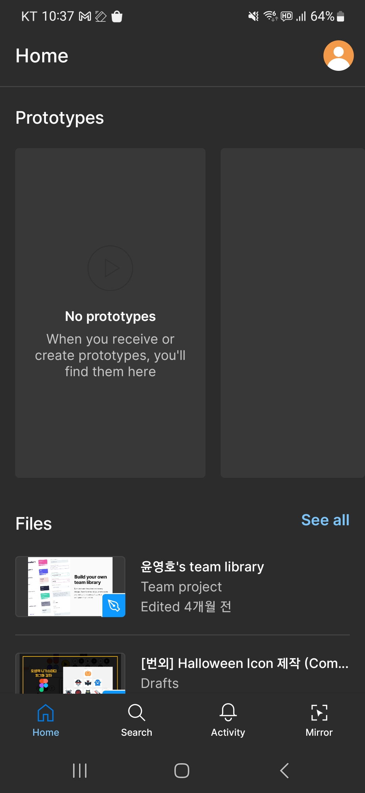
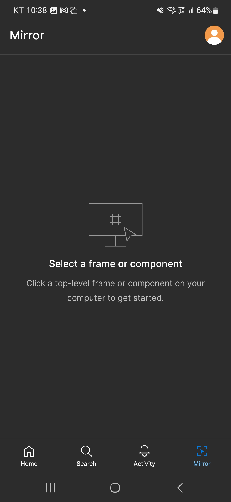
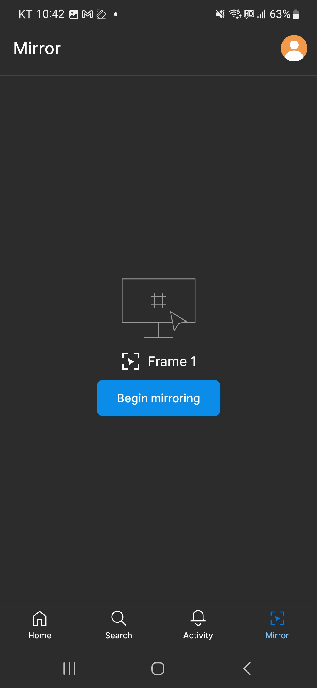
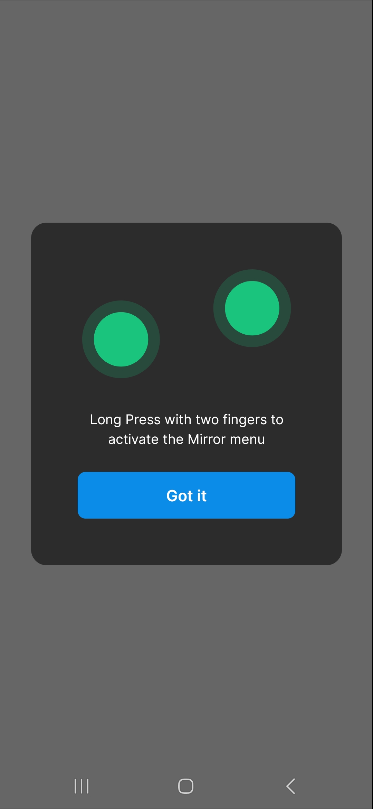

# Ch04. 피그마 화면미러링(3)

 
 

피그마는 화면 미러링을 통해 쉽게 자신이 작업한 내용을 마치 모바일에서 보는 것처럼 테스트 할 수 있으며, 아래처럼 두 가지 방식으로 테스트 하실 수 있습니다.

   

## 1. 웹에서 화면 미러링

 

- [https://www.figma.com/mirror](https://www.figma.com/mirror) => 주소로 접속 후 화면처럼 나란히 두고 사용하시면 확인하실 수 있습니다.
  
  

 

- 콤포넌트 선택

  

 
 

## 2. 모바일 폰에서 미러링

 

- 앱스토어에서 검색 : figma mirror => 폰에 설치 후 사용

 

1) 앱 설치  

 
                                                   
2) 피그마 계정 로그인    

 
                           
3) 하단메뉴 :  Mirror 선택  

 

4) 콤포넌트 선택  

 
                                       
5) Got it 선택    

 
                                        
6) 선택된 화면 출력

  

 
 
  

※  피그마 데스크탑 앱에서 콤포넌트를 선택해야만 (4)번처럼 선택한 콤포넌트 이름이 나타나게 됩니다!